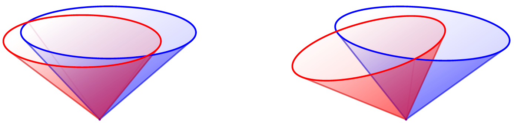

# TikZ code snipped for drawing a pair of null cones (NC).

## Command: `\nullCones`

Usage: `\nullCones{pos}{g NC parameterss}{f NC parameters}`

### Parameters (with defaults)

  `x=0, y=1, a=1, b=0.5, rotate = 0`.

-  The top ellipse is at `(x,y)` with axes `(a,b)`. 
- The null cone is optionally rotated by an angle.
-  Layers can be back, front, or outline.

## Command: `\nullConesOutline` and `\nullConesShaded`

- `\nullConesOutline` draws only an outline of the null cones.

- `\nullConesShaded` draws the fully shaded null cones.

- By default `\nullCones = \nullConesShaded` (controlled by `\ifOutline`).

## Examples (See: [nullCones.pdf](nullCones.pdf))

```
  \coordinate (nc2) at (-0.5,2.5);
  \nullCones{nc1}{ x=  0.1, y= 1  , a= 1  , b= 0.3  }
                 { x= -0.2, y= 0.9, a= 0.9, b= 0.3  }

  \coordinate (nc1) at (-4,2.5);
  \nullCones{nc2}{ x=  0.1, y= 1  , a= 1  , b= 0.3, rotate = -5 }
                 { x= -0.2, y= 0.9, a= 0.9, b= 0.3, rotate = 15 }
```

